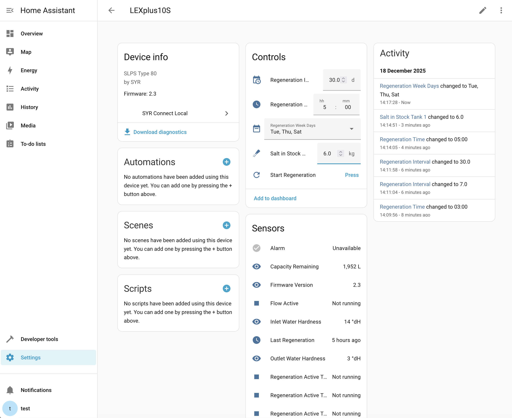

# SYR Connect Local — Home Assistant

Local SYR endpoints so your device can talk to Home Assistant without the cloud.

## For HACS Users (what you really need)

- **DNS override required:** point these hostnames to your HA host IP: `syrconnect.de`, `syrconnect.consoft.de`, `connect.saocal.pl`, `maintenance.syrconnect.de`.
- **HTTPS certificates:** only needed if your device firmware uses HTTPS (≈1.9+). Place in `/config`:
  - `syr_cert.pem`
  - `syr_key.pem`
- **Add the integration:** Settings → Devices & Services → Add Integration → “SYR Connect Local”.
  - HTTP Port: 80
  - HTTPS Port: 443 (optional)
  - Enable HTTPS only if your device actually calls HTTPS.
- Entities appear after the first device data; controls (e.g., regeneration interval, salt volume) update after the device’s next poll.

## Development / Local Docker Setup

For contributors or local testing, run HA from this repo.

Prerequisites:
- Docker and Docker Compose
- DNS override as above so your SYR device hits this host

Quick start:

```bash
# From the repo root
docker compose up -d

# Follow first boot logs
docker logs home-assistant --follow
```

Ports (from [docker-compose.yml](docker-compose.yml)):
- 8123 → Home Assistant UI
- 80   → SYR Connect Local HTTP (firmware ≈ 1.7)
- 443  → SYR Connect Local HTTPS (firmware ≈ 1.9+)

## Add the Integration in HA

1. Open HA → Settings → Devices & Services → Add Integration → “SYR Connect Local”.
2. Configure ports and HTTPS as above.
3. Submit and wait for your device to connect. Entities will appear after first data.

### Entities & Controls

- Sensors and binary sensors are added automatically when the device first connects.
- **Start Regeneration button** (entity category: config) triggers an immediate regeneration (`setSIR=0`).
- Services: `syr_connect_local.start_regeneration` and `syr_connect_local.update_parameter` for direct commands.

### Device Overview

Example device view with controls and sensors:



### Logging & Safety

- Polling responses now include only getters; setters are sent **only** when you press the button or call a service.
- Command flow is logged at INFO level:
  - `Command queued for device <serial>: <cmd>=<value>`
  - `Sending N commands to device <serial>: ...`

## Protocol Getters & Setters (human-readable)

Key getters (read-only data the device sends):
- `getRPD`: Regeneration interval (days)
- `getRPW`: Regeneration weekdays bitmask (0–6 = Mon–Sun)
- `getRTH`: Regeneration hour (0–23)
- `getSV1`: Salt volume tank 1 (kg)
- `getOWH` / `getIWH`: Outlet / inlet water hardness
- `getRES`: Remaining capacity (liters)
- `getPRS`: Water pressure (bar ×10), `getFLO`: Flow (L/min)
- `getRG1/2/3`: Regeneration active flags per tank
- `getALM`: Alarm status, `getSTA`: Status text

Key setters (commands we send to the device):
- `setSIR`: Start immediate regeneration (send 0 to trigger)
- `setRPD`: Set regeneration interval (days)
- `setRPW`: Set regeneration weekdays bitmask
- `setRTH`: Set regeneration hour (0–23)
- `setSV1/2/3`: Set salt volume per tank (kg)
- `setIWH` / `setOWH`: Set inlet / outlet hardness
- `setWHU`: Set hardness unit (0=°dH, 1=°fH, 2=°eH)
- `setAB`: Valve shut-off (1=open, 2=closed) on supported models

Notes:
- All periodic polls request only getters; setters are sent only when you change a control or call a service.
- The integration queues setters until the device’s next poll, then requests a refresh to show the updated value.

## HTTPS (Optional)

If enabling HTTPS, place a certificate and key in HA’s `/config`:

- `/config/syr_cert.pem`
- `/config/syr_key.pem`

Generate self-signed certs for local testing:

```bash
openssl req -x509 -newkey rsa:2048 -nodes \
  -keyout syr_key.pem -out syr_cert.pem -days 3650 \
  -subj "/CN=syrconnect.local" \
  -addext "subjectAltName=DNS:syrconnect.de,DNS:syrconnect.consoft.de,DNS:connect.saocal.pl,DNS:maintenance.syrconnect.de,DNS:localhost,IP:127.0.0.1"

docker cp syr_cert.pem home-assistant:/config/syr_cert.pem
docker cp syr_key.pem  home-assistant:/config/syr_key.pem
```

Then enable HTTPS in the integration options.

## Verify Endpoints

```bash
# HTTP
curl -s http://localhost:80/WebServices/SyrConnectLimexWebService.asmx/GetBasicCommands -d "<xml/>"

# HTTPS (self-signed)
curl -s https://localhost:443/WebServices/SyrConnectLimexWebService.asmx/GetBasicCommands -k -d "<xml/>"
```

Follow logs for activity:

```bash
docker logs home-assistant --follow 2>&1 | grep -i syr_connect_local
```

## Debug Endpoints (optional)

Enable in HA → Integration Options → “Debug endpoints”.

```bash
curl -s http://<HA_HOST_IP>:80/status
curl -s http://<HA_HOST_IP>:80/echo
```

Disable when done (they return 404 if disabled).

## Notes

- Ensure your network/DNS points the SYR domains to your HA host IP.
- Secrets and HA runtime files are ignored by [.gitignore](.gitignore); keep device-specific config in `homeassistant/config`.

## License

This project is licensed under the MIT License - see the LICENSE file for details.

## Credits

- Protocol documentation: [syrlex2mqtt](https://github.com/Richard-Schaller/syrlex2mqtt) by Richard Schaller
- Inspired by the [ioBroker.syrconnect](https://github.com/eifel-tech/ioBroker.syrconnect) project

## Support

If you encounter issues or have questions:

1. Check the [Troubleshooting](#troubleshooting) section
2. Search [existing issues](https://github.com/Rednox/syr-local-connect/issues)
3. Create a [new issue](https://github.com/Rednox/syr-local-connect/issues/new) with:
   - Home Assistant version
   - Integration version
   - Device model and firmware version
   - Relevant log entries
   - Description of the problem
