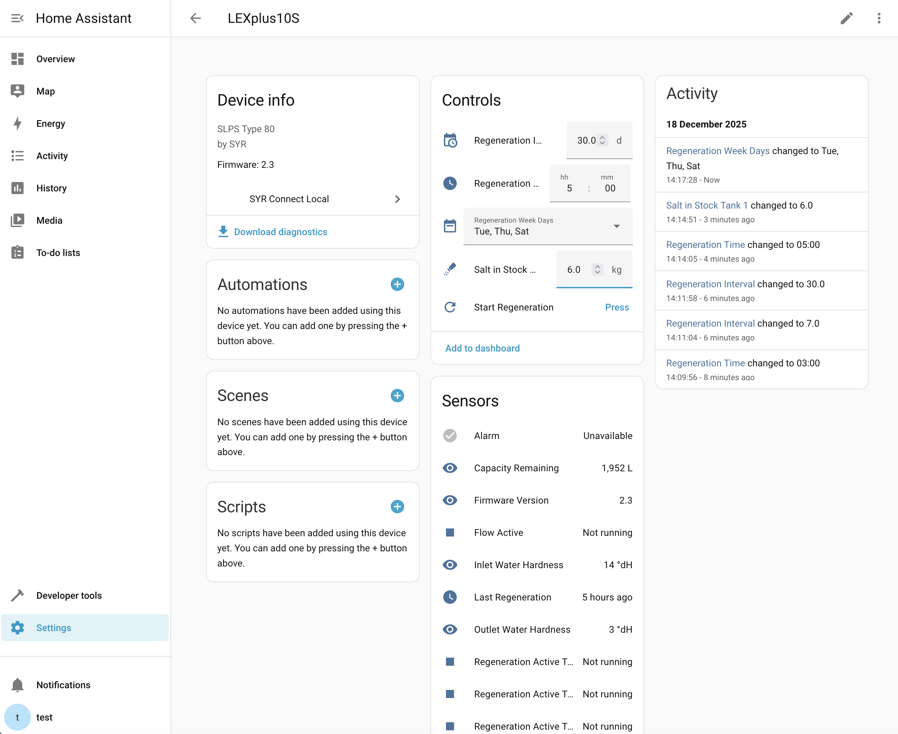

# SYR Connect Local — Home Assistant

Local SYR endpoints so your device can talk to Home Assistant without the cloud.

## For HACS Users (what you really need)

- **DNS override required:** point these hostnames to your HA host IP: `syrconnect.de (212.77.236.30)`, `iot3.syrconnect.de`.
- **HTTPS certificates:** only needed if your device firmware uses HTTPS (≈1.9+). Place in `/config`:
  - `syr_cert.pem`
  - `syr_key.pem`
- **Add the integration:** Settings → Devices & Services → Add Integration → “SYR Connect Local”.
  - HTTP Port: 80
  - HTTPS Port: 443 (optional)
  - Enable HTTPS only if your device actually calls HTTPS.
- Entities appear after the first device data; controls (e.g., regeneration interval, salt volume) update after the device’s next poll.

## Development / Local Docker Setup

For contributors or local testing, run HA from this repo.

Prerequisites:
- Docker and Docker Compose
- DNS override as above so your SYR device hits this host

Quick start:

```bash
# From the repo root
docker compose up -d

# Follow first boot logs
docker logs home-assistant --follow
```

Ports (from [docker-compose.yml](docker-compose.yml)):
- 8123 → Home Assistant UI
- 80   → SYR Connect Local HTTP (firmware ≈ 1.7)
- 443  → SYR Connect Local HTTPS (firmware ≈ 1.9+)

### Preserving the real client IP

Docker's default bridge networking rewrites the source IP of incoming
connections to the Docker gateway (e.g. `172.18.0.1`). This makes the legacy
TLS allowlist and device source-IP checks see the gateway IP instead of the
real device IP (`192.168.x.x`).

Options to preserve the real client IP:

1. **Host networking (recommended for Linux / Colima)**  
   Use [docker-compose.host-network.yml](docker-compose.host-network.yml) so
   the container shares the host network stack and sees the original source IPs
   directly:
   ```bash
   docker compose -f docker-compose.host-network.yml up -d
   ```
   On macOS with Colima you may need to enable LAN-reachable addresses:
   ```bash
   colima stop
   colima start --network-address
   ```

2. **Reverse proxy with `X-Forwarded-For`**  
   Put a proxy on the host network in front of the container and have it add
   `X-Forwarded-For: <real-client-ip>`. The integration prefers this header over
   the transport peer address.

3. **MAC-based allowlist (works with bridge networking)**  
   Even if the IP shown is the Docker gateway, the integration falls back to
   matching the allowlist by the device's MAC address, so adding the discovered
   `172.18.0.1|<mac>` tuple still works.

### use colima

```bash
brew install colima docker docker-compose
colima start --cpu 4 --memory 6 --disk 40
docker context use colima
docker info
docker compose -f docker-compose.colima.yml up -d
docker logs -f home-assistant

docker compose -f docker-compose.colima.yml down
```

### Run tests manually (pytest)

Create an isolated Python environment in the repo root and install test dependencies:

```bash
# From repo root
/opt/homebrew/bin/python3.13 -m venv .venv
.venv/bin/python -m pip install -U pip
.venv/bin/python -m pip install pytest pytest-asyncio pytest-aiohttp aiohttp
```

Run all tests:

```bash
.venv/bin/python -m pytest -q
```

Run only in-process/local server tests:

```bash
.venv/bin/python -m pytest -q tests/test_server_local.py
```

Run black-box tests against a running HA container:

```bash
# Requires the container/server to be up and reachable on localhost:80/443
RUN_BLACKBOX=1 .venv/bin/python -m pytest -q tests/test_server_blackbox.py
```

Optional black-box overrides:

```bash
RUN_BLACKBOX=1 \
SYR_TEST_HOST=192.168.1.10 \
SYR_TEST_HTTP_PORT=80 \
SYR_TEST_HTTPS_PORT=443 \
.venv/bin/python -m pytest -q tests/test_server_blackbox.py
```

Notes:
- Do not use `pipx` for these test libraries; use the project `.venv`.
- If you run `pytest` from the wrong path, use `tests/test_server_blackbox.py` (not `test_server_blackbox.py`).

## Add the Integration in HA

1. Open HA → Settings → Devices & Services → Add Integration → “SYR Connect Local”.
2. Configure ports and HTTPS as above.
3. Submit and wait for your device to connect. Entities will appear after first data.

### Entities & Controls

The integration automatically creates entities across multiple platforms:

- **Sensors**: Water hardness (inlet/outlet), salt tank capacity/volume, flow rate, pressure, remaining capacity, regeneration counts, water consumption (daily/weekly/monthly)
- **Binary Sensors**: Regeneration active per tank, alarm status
- **Buttons**: Start regeneration, manual refresh
- **Numbers**: Regeneration interval (days), salt volumes per tank, water hardness setters
- **Selects**: Regeneration weekday preferences (pre-defined schedules or custom)
- **Time**: Regeneration schedule time picker

**Key Controls**:
- **Start Regeneration button** (entity category: config) triggers an immediate regeneration (`setSIR=0`)
- **Regeneration interval/weekday/time**: Configure scheduling via number, select, and time entities
- **Salt volumes**: Adjust per-tank salt levels via number entities
- **Water hardness**: Set inlet/outlet hardness values and unit preference

**Services**:
- `syr_connect_local.start_regeneration`: Trigger immediate regeneration
- `syr_connect_local.update_parameter`: Generic parameter update for advanced automation

### Device Overview

Example device view with controls and sensors:



### Logging & Safety

- Polling responses now include only getters; setters are sent **only** when you press the button or call a service.
- Command flow is logged at INFO level:
  - `Command queued for device <serial>: <cmd>=<value>`
  - `Sending N commands to device <serial>: ...`

## Protocol Getters & Setters (human-readable)

Key getters (read-only data the device sends):
- **Regeneration**: `getRPD` (interval days), `getRPW` (weekdays), `getRTH` (hour), `getRG1/2/3` (active per tank)
- **Water Quality**: `getIWH` (inlet hardness), `getOWH` (outlet hardness), `getWHU` (hardness unit)
- **Salt Tanks**: `getSV1/2/3` (volume kg), `getCS1/2/3` (capacity %), `getSD1/2/3` (days remaining), `getSW1/2/3` (weeks remaining)
- **Flow & Pressure**: `getFLO` (L/min), `getPRS` (bar ×10), `getFCO` (flow counter), `getRES` (remaining capacity liters)
- **System**: `getALM` (alarm), `getSTA` (status), `getPST` (power state)
- **Consumption**: `getTOF` (today), `getYEF` (yesterday), `getCWF` (this week), `getCMF` (this month), `getCOF` (total), daily breakdown per weekday

Key setters (commands we send to the device):
- **Regeneration**: `setSIR` (trigger immediate), `setRPD` (interval days), `setRPW` (weekdays), `setRTH` (hour)
- **Water Hardness**: `setIWH` (inlet), `setOWH` (outlet), `setWHU` (unit: 0=°dH, 1=°fH, 2=°eH)
- **Salt Volumes**: `setSV1/2/3` (per tank, kg)

## Known Limitations & Notes

- **Power switch**: Control is experimental and commented out pending device-specific testing
- **Multi-device support**: Available but currently untested in production
- **DVGW Compliance**: The regeneration interval is limited to 4 days maximum in accordance with DVGW (DIN 1988 / DIN EN 806 / DIN EN 1717) standards. A compliance sensor will alert if the device interval exceeds this limit—the user is responsible for regulatory compliance.
- **Polling behavior**: All periodic polls request only getters; setters are sent only when you change a control or call a service
- **Asynchronous updates**: The integration queues setters until the device's next poll, then requests a refresh to show the updated value

## Protocol Notes

- Ensure your network/DNS points the SYR domains to your HA host IP
- Secrets and HA runtime files are ignored by [.gitignore](.gitignore); keep device-specific config in `homeassistant/config`

If enabling HTTPS, place a certificate and key in HA’s `/config`:

- `/config/syr_cert.pem`
- `/config/syr_key.pem`

Generate self-signed certs for local testing:

```bash
openssl req -x509 -newkey rsa:2048 -nodes \
  -keyout syr_key.pem -out syr_cert.pem -days 3650 \
  -subj "/CN=syrconnect.local" \
  -addext "subjectAltName=DNS:syrconnect.de,DNS:syrconnect.consoft.de,DNS:connect.saocal.pl,DNS:maintenance.syrconnect.de,DNS:localhost,IP:127.0.0.1"

docker cp syr_cert.pem home-assistant:/config/syr_cert.pem
docker cp syr_key.pem  home-assistant:/config/syr_key.pem
```

Then enable HTTPS in the integration options.

## Verify Endpoints

```bash
# HTTP
curl -s http://localhost:80/WebServices/SyrConnectLimexWebService.asmx/GetBasicCommands -d "<xml/>"

# HTTPS (self-signed)
curl -s https://localhost:443/WebServices/SyrConnectLimexWebService.asmx/GetBasicCommands -k -d "<xml/>"
```

Follow logs for activity:

```bash
docker logs home-assistant --follow 2>&1 | grep -i syr_connect_local
```

## Debug Endpoints (optional)

Enable in HA → Integration Options → “Debug endpoints”.

```bash
curl -s http://<HA_HOST_IP>:80/status
curl -s http://<HA_HOST_IP>:80/echo
```

Disable when done (they return 404 if disabled).

## License

This project is licensed under the MIT License - see the LICENSE file for details.

## Credits

- Protocol documentation: [syrlex2mqtt](https://github.com/Richard-Schaller/syrlex2mqtt) by Richard Schaller
- Inspired by the [ioBroker.syrconnect](https://github.com/eifel-tech/ioBroker.syrconnect) project

## Troubleshooting & Support

**Common Issues**:
- **Entities not appearing**: Check DNS overrides are set correctly and device is connected to the network
- **HTTPS connection fails**: Verify certificates are in `/config` and device firmware supports HTTPS
- **Commands not updating**: Wait for the device's next poll cycle (default: every 5 minutes)
- **Device IP shows as a Docker gateway (e.g. 172.18.0.1)**: This is expected with Docker bridge networking. Use host networking (see [Preserving the real client IP](#preserving-the-real-client-ip)), a reverse proxy with `X-Forwarded-For`, or rely on the MAC-based allowlist fallback.

**Getting Help**:
1. Enable debug logging in HA: `logger` integration with `syr_connect_local` set to DEBUG
2. Check [existing issues](https://github.com/Rednox/syr-local-connect/issues)
3. Create a [new issue](https://github.com/Rednox/syr-local-connect/issues/new) with:
   - Home Assistant version
   - Integration version
   - Device model and firmware version
   - Relevant debug log entries
   - Description of the problem


## Nice to Know

- In the SYR Lex Plus firmware 2.4 they changed the cloud push mechanism domain to iot3.syrconnect.de
- ClientHello still uses TLSv1 for SYR Lex Plus firmware 2.4
- Further Syr Endpoint but not required here: `connect.saocal.pl`, `maintenance.syrconnect.de (67.207.73.145)` , `firmware.syrconnect.de (207.154.224.234)`
- SYR Lex Plus firmware 2.4 pushes data every 10 seconds